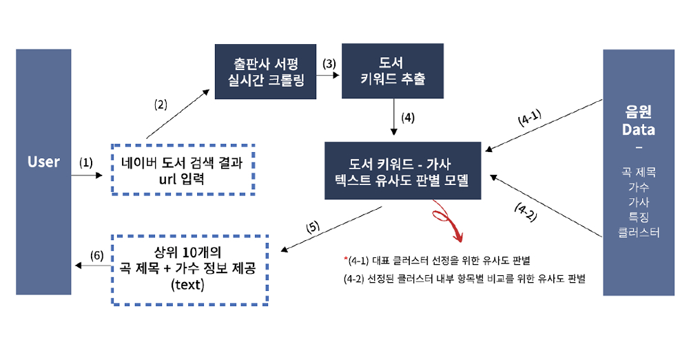
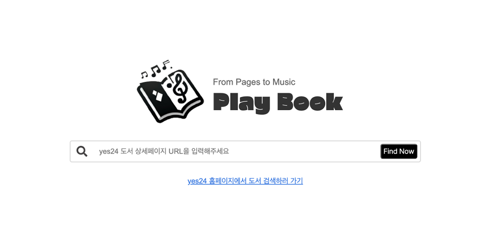
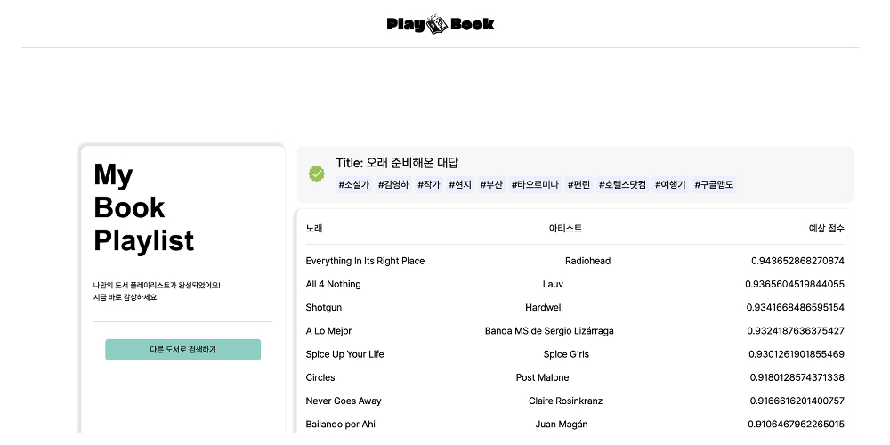

# 책 기반 플레이리스트 추천

## 프로젝트 구조

- spotify api 활용 및 아티스트 웹 크롤링을 통해 음악 데이터 구성
- 음악 데이터를 t-sne, k-means 방법으로 클러스터링하여 클러스터 번호 부여
- keybert 모델 활용하여 도서 크롤링 정보로부터 키워드 추출
- 추출한 키워드와 음악 데이터의 각 클러스터별 샘플 n개를 Roberta-DNLI 모델 활용하여 스코어링
- 가장 평균 스코어가 높은 클러스터를 선정, 해당 클러스터에 포함된 음악 전부에 대해서 Roberta-DNLI 스코어링
- 레이블이 ENTAILMENT인 곡 중 스코어를 내림차순으로 정렬해서 10개의 플레이리스트 추출

## 간편 실행하기

### HOW TO
다음 링크를 통해 접속해서 yes24 도서 링크를 입력하세요
- 페이지 로드가 되지 않을 경우 다른 브라우저에서 접속을 시도해주세요
- 서버가 켜져있을 때만 다음 링크가 작동합니다. 만약 접속이 안 된다면 로컬에서 실행하기를 시도해주세요.

[책 기반 플레이리스트 추천 페이지 바로가기](http://www.booknsong.online/)

### 결과

## 로컬에서 실행하기
### HOW TO
플레이리스트 추출을 로컬에서 실행하기 위해서는 
- data, python_files 디렉토리를 복사하고,
- 필요한 패키지를 설치하고,
- 현재 디렉토리에 output 폴더가 생성되어 있는지 먼저 확인 후

터미널에 다음을 입력하세요.

    python ./python_files/local_playlist.py

### 결과
결과는 다음 경로에 저장됩니다.

    output/{YOUR_PLAYLIST}.csv
    output/{YOUR_PLAYLIST}.html

